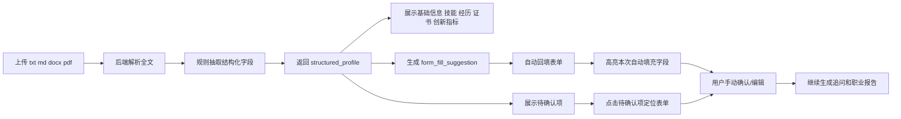

# 简历结构化与表单回填设计

## 目标

实现一条稳定的链路：`简历上传 -> 文本解析 -> 结构化抽取 -> 待确认提示 -> 表单回填`。

## 当前能力

- 支持 `txt / md / docx / pdf`
- PDF 通过 `PyPDF2` 进行文本层提取
- 对扫描版 PDF 会友好提示“已读取但未提取到有效文本”
- 解析完成后自动回填前端表单，并高亮本次自动填充字段
- 点击待确认项可直接定位到对应表单区域

## 核心输出

- 基本信息：姓名、学校、专业、学历、毕业年份
- 技能：编程语言、框架、工具，统一映射到技能词汇表
- 经历：项目、实习、校园经历
- 证书：证书名称、时间
- 创新指标：获奖、专利、论文、创业
- 待确认项：低置信度字段和缺失字段
- 回填建议：为前端表单生成可直接使用的字段集合

## 提取策略

### 1. 文本预处理

- 统一换行和空白字符
- 按行拆分
- 基于章节标题切分成 `education/project/internship/campus/skills/certificate/award/innovation`

### 2. 基本信息抽取

- 姓名：优先匹配 `姓名: xxx`，其次使用首行短文本启发式
- 学校：匹配 `大学/学院/学校` 结尾模式
- 专业：优先使用 `专业/主修` 显式标签，回退到教育经历行剥离学校/学历/年份后的候选值
- 学历：关键词匹配 `博士/硕士/本科/专科`
- 毕业年份：优先匹配 `毕业时间/预计毕业`，回退到全文最后一个年份

### 3. 技能抽取

- 从技能段、项目段、实习段和前 20 行文本中提取
- 对技能别名做归一化，如 `springboot -> Spring Boot`
- 与知识库技能词汇表做匹配，输出：
  - `programming_languages`
  - `frameworks`
  - `tools`
  - `matched_skills`
  - `unmatched_candidates`

### 4. 经历抽取

- 先按标题/时间线分块
- 再对每块提取：
  - title
  - organization
  - role
  - time_range
  - description
  - tech_stack
  - achievements
- 项目经历支持标题行与时间行自动合并
- 实习/校园经历支持组织名和角色的规则抽取

### 5. 创新指标抽取

- 奖项：`一等奖/二等奖/获奖/荣誉`
- 专利：`专利/发明专利/实用新型`
- 论文：`论文/发表/期刊/会议/EI/SCI`
- 创业：`创业/创始人/联合创始人/孵化/营收`

### 6. 待确认机制

以下情况标记为 `pending_confirmation`：

- 低置信度启发式抽取
- 字段缺失
- 经历块中未识别出必要字段
- 证书缺少获得时间

系统会把内部规则码转换成自然中文说明，例如：

- `根据简历首行推断得到，建议人工确认。`
- `项目中未识别出你的职责角色，建议补充负责模块或分工。`
- `证书获得时间缺失，建议补充年份。`

## 前端交互

## 关键文件

- `backend/app/services/resume_parser.py`
- `backend/app/services/resume_structurer.py`
- `backend/app/api/routes/planning.py`
- `backend/app/static/index.html`
- `backend/app/static/app.js`
- `backend/app/static/styles.css`
- `tests/test_resume_structuring.py`

## 测试样例

1. 标准中文技术简历：验证基本信息、技能、项目经历抽取
2. 含公司名和校园组织的经历简历：验证组织名、角色、时间识别
3. 创新型简历：验证奖项、论文、专利、创业经历识别
4. 字段缺失简历：验证 `pending_confirmation` 和自然语言原因
5. PDF 简历：验证 PDF 解析链路和降级提示
